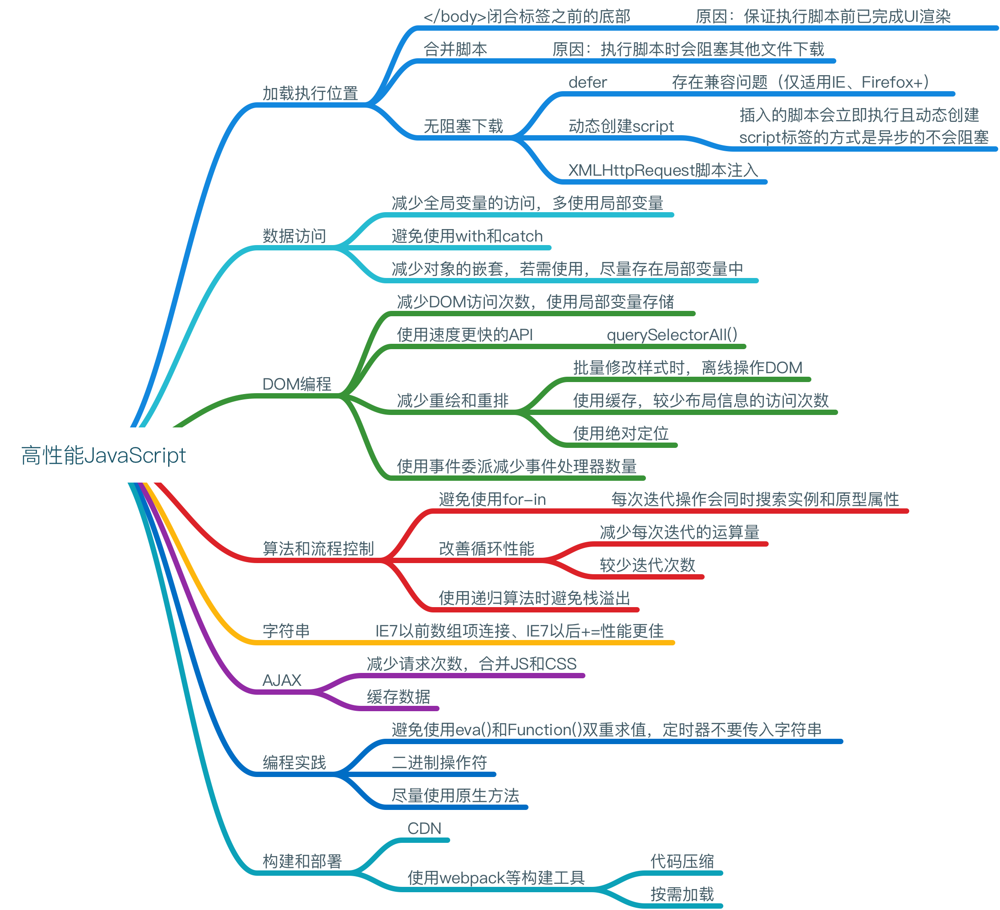

## 加载和执行

浏览器在执行JavaScript 代码时，页面渲染和用户交互被阻塞。

### 脚本的位置

推荐将所有的<script>标签尽可能放到<body>标签的底部

### 组织脚本

由于每个<script>标签初始下载时都会阻塞页面渲染，所以减少页面包含的<script>标签数量有助于改善这一情况。（ HTTP请求会带来额外的性能开销） =>  打包工具、CDN（提供了合并处理器）

### 无阻塞脚本

减少JavaScript文件大小并限制HTTP请求数

在页面加载完成后才加载JavaScript代码 =>  window.onload

#### 延迟的脚本

defer

局限：该属性只有IE4+和FireFox3.5+可用

#### 动态脚本元素

```javascript
var script = document.createElement("script")
script.type = "text/javascript"
script.onload = function() {
    alert("Script loaded!")
}
script.src = "file1.js"
document.getElementByTagName("head")[0].appendChild(script)
```

动态脚本加载凭借着它跨浏览器兼容性和易用的优势，成为最通用的无阻塞加载解决方案。

#### XMLHttpRequest脚本注入

```javascript
var xhr = new XMLHttpRequest()
xhr.open('get', "file1.js", true)
xhr.onreadystatechange = function() {
    if(xhr.readyState === 4) {
        if(xhr.status >= 200 && xhr.status < 300 || xhr.status ===304) {
            var script  = document .createElement("script")
            script.type = "text/javascript"
            script.text = xhr.responseText
            document.body.appendChild(script)
        }
    }
}
xhr.send(null)
```

局限：JavaScript文件必须与所请求的页面处于相同的域，这意味着JavaScript文件不能从CDN下载。因此，大型的Web应用通常不会采用XHR脚本注入技术。

### 小结

* </body>闭合标签之前，将所有<script>标签放到页面底部。
* 合并脚本。
* 多种无阻塞下载JavaScript的方法： defer、动态创建、XHR                                                                                                                                                                                                                                                                                                

## 数据访问

### 管理作用域

#### 作用域链和标识符解析

#### 标识符解析的性能

在运行期上下文的作用域链中，一个标识符所在的位置越深，它的读取速度也就越慢。

如果某个跨作用域的值在函数中被引用一次以上，那么就把它存储到局部变量里。

#### 改变作用域链

with、catch

####  动态作用域

若存在动态作用域，脚本引擎必须切换回比较慢的基于哈希表的标识符识别方式，因此，只有确实有必要时才推荐使用动态作用域查找。

#### 闭包，作用域和内存

```
function assignEvents() {
    var id  = "xdi9592"
    document.getElementById('save-btn").onclick = function(event) {
        saveDocument(id)
    }
}
```
当该函数被执行时，一个包含了变量id以及其他一些数据的**活动对象** 被创建，当闭包被创建时，它的[[scope]]属性包含了与运行期相同的对象的引用，因此会有一项副作用。
在脚本里，最好小心地使用闭包，它同时关系到内存和执行速度。

### 对象成员

#### 原型

#### 原型链

#### 嵌套成员

对象成员嵌套得越深，访问速度就会越慢。

#### 缓存对象成员值

 ```javascript
const { name } = student 
 ```

### 小结

* 访问直接量和局部变量速度最快，相反，访问数组元素和对象成员相对较慢。
* 由于局部变量存在于作用域链的起始位置，因此访问局部变量比访问跨作用域变量更快。变量在作用域链中位置越深，访问所需时间越长。由于全局变量总处在作用域链的最末端，因此访问速度是最慢的。
* 避免使用with语句，因为它会改变运行时期上下文作用域链。同样，try-catch语句中catch子句也有同样的影响，尽量少用。
* 嵌套的对象成员会明显影响性能，尽量少用。
* 属性或方法在原型链中的位置越深，访问它的速度越慢。
* 通常来说，你可以通过把常用的对象成员、数组元素、跨域变量保存在局部变量中来改善JavaScript性能，因为局部变量访问速度更快。


## DOM编程

用脚本进行DOM操作的代价很昂贵，它是富Web应用中最常见的性能瓶颈。

### 浏览器中的DOM

#### 天生就慢

两个相互独立的功能只要通过接口彼此连接，就会产生消耗。

### DOM访问与修改

减少访问DOM的次数，把运算尽量留在ECMAScript这一端处理。

#### innerHTML对比DOM方法

如果在一个对性能有着苛刻要求的操作中更新一大段HTML，推荐使用innerHTML，因为它在绝大部分浏览器中都运行得更快。

#### 节点克隆

element.cloneNode()

在大多数浏览器中，节点克隆都更有效率。

#### HTML集合

HTML集合对象是一个类似数组的列表。它们并不是真正的数组。

在相同的内容和数量下，遍历一个数组的速度明显快于遍历一个HTML集合。

在遍历该列表时，可做下列优化：

* len = coll.length 将读取列表长度的操作放到循环外面
* 将列表转换成数组再进行遍历

#### 遍历DOM

##### 在DOM中爬行

在IE中，nextSibling比childNode表现优异。

##### 元素节点

使用children替代childNodes会更快，因为集合项更少。

##### 选择器API

如果需要处理大量的组合查询，使用querySelectorAll()会更有效率。

### 重绘与重排

#### 重排何时发生

当也变布局和几何属性改变时就需要“重排”。

* 添加或删除可见的DOM元素
* 元素位置改变。
* 元素尺寸改变。
* 内容改变。
* 页面渲染器初始化。
* 浏览器窗口尺寸改变。

#### 渲染树变化的排队与刷新

不要再布局信息改变时查询无关的属性，会导致刷新渲染队列并重排。

#### 最小化重绘和重排

一个好的提高程序响应速度的策略就是减少重绘和重排操作的发生。为了减少次数，应该合并多次对DOM和样式的修改。

##### 改变样式

栗子:

```javascript
var el = document.getElementById('mydiv')
el.style.borderLeft = '1px'
el.style.borderRight = '2px'
el.style.padding = '5px'
```

方式一：

使用cssText属性合并所有的改变。

```javascript
var el = document.getElementById('mydiv')
el.style.cssText = 'border-left: 1px; border-right: 2px; padding: 5px;'
```

方式二：

通过类名修改css样式。

 ```javascript
var el = document.getElementById('mydiv')
el.className = 'active'
 ```

##### 批量修改DOM

可以通过以下步骤减少重绘和重排的次数：

1. 使元素脱离文档流
2. 对其引用多重改变
3. 把元素带回文档中

有三种基本方法可以使DOM脱离文档：

* 隐藏元素
* 使用文档片段(document fragment)在当前DOM之外构建一个子树（推荐）
* 将原始元素拷贝到一个脱离文档的节点中

#### 缓存布局信息

#### 让元素脱离动画流

#### IE和hover

### 事件委托（冒泡）

当页面中存在大量元素，而且每一个都要一次或多次绑定事件处理器时，这种情况可能会影响性能。每绑定一个事件处理器都是有代价的，要么是加重了页面的负担，增加了运行期的执行时间，时间绑定占用了处理时间，而且浏览器需要追逐每个事件处理器，这也会占用更多的内存。

### 小结

* 最小化DOM访问次数，尽可能在JavaScript端处理。
* 如果需要多次访问某个DOM节点，请使用局部变量存储它的引用。
* 小心处理HTML集合，因为它实时连系着底层文档。把集合的长度缓存到一个变量中，并在迭代中使用它，如果需要经常操作集合，建议把它拷贝到一个数组中。
* 如果可能的话，使用速度更快的API，比如querySelectorAll()和firstElementChild/
* 要留意重绘和重排；批量修改样式时，“离线”操作DOM树，使用缓存，并减少访问局部信息的次数。
* 动画中使用绝对定位，使用拖放代理。
* 使用事件委派来减少时间处理器的数量。

## 算法和流程控制

### 循环

#### 循环的类型

for循环、while循环、do-while循环、for-in循环

#### 循环性能

在JavaScript提供的四种循环类型，只有for-in循环比其他几种明显要慢。由于每次迭代操作会同时搜索实例或原型链属性，for-in循环的每次迭代会产生更多开销，因此比其他类型要慢。**不要用for-in来遍历数组成员**

##### 减少迭代的工作量

###### 减少迭代次数

Duff's Device

#### 基于函数的迭代

forEach

在所有情况下，基于循环的迭代比基于函数的迭代快8倍

### 条件语句

#### if-else对比switch

条件数量越大，越倾向于使用switch。

#### 优化if-else

* 确保最可能出现的条件放在首位。
* 把if-else组织成一系列嵌套的if-else语句。

#### 查找表

```javascript
var results = [result0, result1, result2, result3, result4, result5]
return results[value]
```

### 递归

递归函数的潜在问题是终止条件不明确或缺少终止条件会导致函数长时间运行，并使得用户界面处于假死状态。

#### 调用栈限制

#### 递归模式

#### 迭代

任何递归能实现的算法也可以同样用迭代来实现。

#### Memoization

```javascript
// fundamental需要增加缓存功能的函数 cache可选的缓存对象
function memoriza(fundamental, cache) {
    cache = cache || {}
    var shell = function(arg) {
        if(!cache.hasOwnProperty(arg)) {
            cache[arg] = fundamental(arg)
        }
        return cache[arg]
    }
    return shell
}
```

### 小结

* for、while和do-while循环性能相似，所以没有一种循环类型明显快于或慢于其他类型。
* 避免使用for-in循环，除非你要遍历一个属性数量未知的对象。
* 改善循环性能的最佳方式是减少每次迭代的运算量和减少循环迭代次数。
* 通常来说，switch总是比if-else快，但并不是最佳解决方案。
* 在判断条件较多时，使用查找表比if-else和switch更快。
* 浏览器的调用栈大小限制了递归算法在JavaScript中的应用；栈溢出错误会导致其他代码中断运行。
* 如果你遇到栈溢出错误，可将方法改为迭代算法，或使用Memoization来避免重复计算。

## 字符串和正则表达式

### 字符串连接

字符串合并的方法

```javascript
// 方法一
str = 'a' + 'b' + 'c'
// 方法二
str = 'a'
str += 'b'
str += 'c'
// 方法三
str = ['a', 'b', 'c'].join('')
// 方法四
str = 'a'
str  = str.concat('b', 'c')
```

#### +和+=操作符

#### 数组项连接

低版本IE较快，一般较慢。

#### String.prototype.cancat

较慢。

### 正则表达式优化

#### 正则表达式工作原理

第一步：编译

第二步：设置起始位置

第三步：匹配每个正则表达式字元

第四步：匹配成功或失败

#### 理解回溯

回溯是匹配过程的基础组成部分。

#### 回溯失控

### 去除字符串首尾空白

### 小结

* 当连接数量巨大或尺寸巨大的字符串时，数组项连接是唯一在IE7及更早版本中性能合理的方法。
* 如果不考虑IE7及更早版本的性能，数组项连接时最慢的字符串连接方法之一。推荐使用简单的+和+=操作符替代，避免不必要的中间字符串。
* 回溯既是正则表达式匹配功能的基本组成部分，也是正则表达式的低效之源。
* 回溯失控发生在正则表达式本应快速匹配的地方，但因为某些特殊的字符串匹配动作导致运行缓慢甚至浏览器崩溃。避免这个问题的办法是：使相邻的字元互斥、避免嵌套量词对同一字符串的相同部分多次匹配，通过重复利用向前查看的原子组去除不必要的回溯。
* 提高正则表达式效率的各种技术手段会有助于正则表达式更快地匹配，并在非匹配位置上花更少的时间。
* 正则表达式并不总是完成工作的最佳工具，尤其当你只搜索字面字符串的时候。
* 尽管有许多方法可以去除字符串的首尾空白，但使用两个简单的正则表达式来处理大量字符串内容能提供一个简洁而跨浏览器的方法。从字符串末尾开始循环向前搜索第一个非空白字符，或者将此技术同正则表达式结合起来，会提供一个更好的替代方案，它很少受到字符串长度影响。

## 快速响应的用户界面

### 浏览器的UI线程

#### 浏览器限制

#### 多久才算“太久”

### 使用定时器让出时间片段

#### 定时器基础

#### 定时器的精度

JavaScript定时器延迟通常不太准确，相差大约几毫秒。

设置定时器延时小于15将会导致IE锁定，所以延迟的最小值建议为25毫秒。

#### 使用定时器处理数组

```javascript
function processArray(items, process, callback) {
    var tode = items.concat() // 克隆原数组
    setTimeout(function() {
        process(todo.shift())
        if (todo.length > 0) {
            setTimeout(arguments.callee, 25)
        } else {
            callback(items)
        }
    }, 25)
}
```

#### 分割任务

#### 记录代码运行时间

#### 定时器与性能

Thomas发现那些间隔在1秒或1秒以上的低频率的重复定时器几乎不会影响web应用的响应速度。

### Web Workers

Web Worker给Web应用带来潜在的巨大性能提升，因为每个新的Worker都在自己的线程中运行代码。

#### Worker运行环境

```javascript
var worker = new Worker('code.js')
```

此代码一执行，将为这个文件创建一个新的线程和一个新的Worker运行环境。该文件会被异步下载，直到文件下载并执行完成后才会启动此Worker。

#### 与Worker通信

```javascript
var worker = new Worker('code.js')
worker.onmessage = function(event) {
    alert(event.data)
}
worker.post Message('Vickie')


// code.js内部代码
self.onmessage = function(event) {
    self.postMessage(`hello ${event.data} !`)
}
```

#### 加载外部文件

#### 实际应用

Web Worker 适用于那些处理纯数据，或者与浏览器UI无关的长时间运行脚本。

解析一个大字符串只是许多受益于Web Worker的任务之一。其他可能受益的任务如下：

* 编码/解码大字符串
* 复杂数学运算（包括图像或视频处理）
* 大数组排序

任何超过100毫秒的处理过程，都应当考虑Woker方案是不是比基于定时器的方案更为合适。

### 小结

* 任何JavaScript任务都不应当执行超过100毫秒。过长的运行时间会导致UI更新出现明显的延迟，从而对用户体验产生负面影响。
* JavaScript运行期间，浏览器想用用户交互的行为存在差异。无论如何，JavaScript长时间运行将导致用户体验变得混乱和脱节。
* 定时器可用来安排代码延迟执行，它使得你可以把长时间运行脚本分解成一系列的小任务。
* Web worker是新版浏览器的特性，它允许你在UI线程外执行JavaScript代码，从而避免锁定UI。

## Ajax

### 数据传输

#### 请求数据

有五种常用技术用于向服务器请求数据

##### XMLHttpRequest

POST和GET对比

对于那些不会改变服务器状态，只会获取数据（幂等行为）的请求，应该使用GET。经GET请求的数据会被缓存起来，如果需要多次请求同一数据的话，它会有助于提升性能。

只有当请求的URL加上参数的长度接近或超过2048字符时，才应该用POST获取数据。这是因为IE限制URL长度，过长时将会导致请求的URL被截断。

#####  动态脚本注入

这种技术克服了XHR的最大限制：它能跨域请求数据。

```javascript
var scriptElement = document.creatElement('script')
scriptElement.scr = 'http://any-domain.com/javascript/lib.js' 
document.getElementsByTagName('head')[0].appendChild(scriptElement)
```


#####  iframes

#####  Comet

#####  Multipart XHR

#### 发送数据

##### XMLHttpRequest

##### Beacons

### 数据格式

#### XML

#### JSON

体积更小，在响应信息中结构所占的比例更小，数据占用得更多，有着极好的通用性，它是性能表现最好的数据格式。

#### HTML

HTML是一种臃肿的数据格式。

#### 自定义格式

#### 数据格式的总结

* JSON-P数据，使用动态脚本注入获取。它把数据当作可执行JavaScript而不是字符串，解析速度极快。它能跨域使用，但设计敏感数据时不应该使用它。
* 字符分割的自定义格式，使用XHR或动态脚本注入获取，用split()解析。折现技术解析大数据集比JSON-P略快，而且通常文件尺寸更小。

### Ajax性能

#### 缓存数据

避免发送不必要的请求：

* 在服务端，设置HTTP头信息以确保你的响应会被浏览器缓存。
* 在客户端，把获取到的信息存储到本地，从而避免再次请求。

##### 设置HTTP头信息

```
Expires: Mon, 28 Jul 2014 23:30:00 GMT
```

##### 本地数据存储

#### 了解Ajax类库的局限

Ajax的接口屏蔽了浏览器之间的差异，这使得XMLHttpRequest有些功能不得已访问

### 小结

* 减少请求次数，可通过合并JavaScript和CSS文件，或使用MXHR。
* 缩短页面的加载时间，页面主要内容完成加载后，用Ajax获取那些次要的文件。
* 确保你的错误代码不会输出给用户，并在服务端处理错误。
* 知道何时使用成熟的Ajax类库，以及何时编写自己底层Ajax代码。

## 编程实践

### 避免双重求值

当你在JavaScript代码中执行另一段JavaScript代码时，都会导致双重求值的性能消耗。

### 使用Object/Array直接量

### 不要重复工作

#### 延迟加载

#### 条件预加载

### 使用速度快的部分

#### 位操作

#### 原生方法

### 小结

* 通过避免使用eval()和Function()构造器来避免双重求值带来的性能消耗。同样的，给setTimeout()和setInterval()传递函数而不是字符串作为参数。
* 尽量使用直接量创建对象和数组。直接量的创建和初始化都比非直接量形式要快。
* 避免做重复的工作。当需要检测浏览器时，可使用延迟加载或条件预加载。
* 在进行数学计算时，考虑使用直接操作数字的二进制形式的位运算。
* JavaScript的原生方法总会比你写的任何代码都要快。尽量使用原生方法。                                                                                                                                    


## 构建并部署高性能JavaScript应用

### Apache Ant

### 合并多个JavaScript文件

### 预处理JavaScript文件

### JavaScript压缩

### 构建时处理对比运行时处理

开发高性能应用的一个普遍规则是，再要是能在构建时完成的工作，就不要留到运行时去做。

### JavaScript的HTTP压缩

### 缓存JavaScript文件

### 处理缓存问题

### 使用内容分发网络（CDN）

使用内容分发网络（CDN）是在互联网上按地理位置分布计算机网络，它负责传递内容给终端用户。

### 部署JavaScript资源

### 敏捷的JavaScript构建过程

### 小结

* 合并JavaScript文件以减少HTTP请求数。
* 使用YUI Compressor压缩JavaScript文件。
* 在服务器端压缩JavaScript文件。
* 通过正确设置HTTP响应头来缓存JavaScript文件，通过向文件名增加时间戳来避免缓存问题。
* 使用CDN（Content Delivery Network）提供JavaScript文件；CDN不仅可以提升性能，它也为你管理文件的压缩和缓存。
